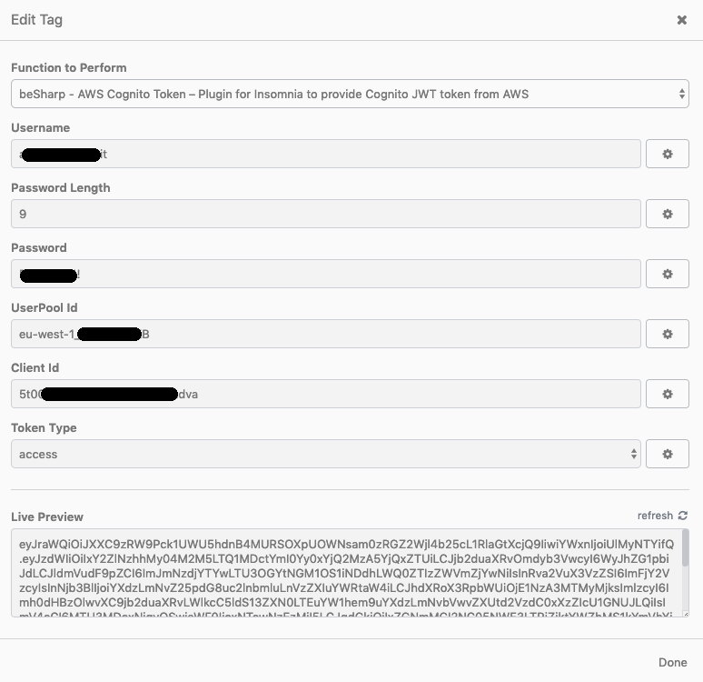
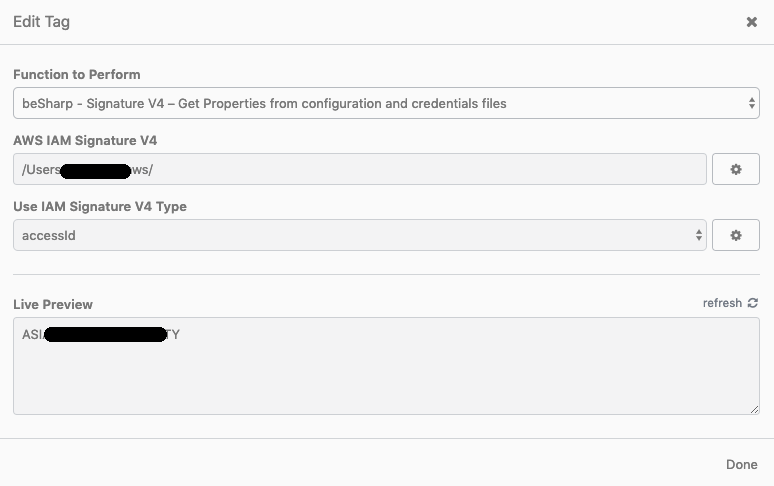
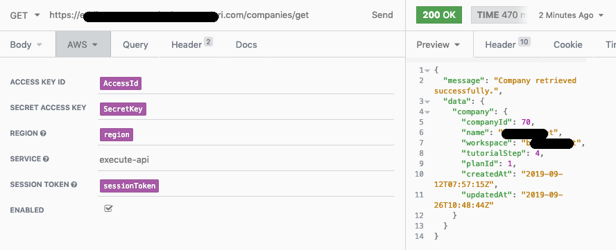

#PROGETTO PLUGIN COGNITO INSOMNIA

Andrea Cavagna - Nicolò Marchesi - Alessandro Gaggia

---

Questo progetto ha lo scopo di creare un plugin per il software Insomnia che permette di testare on the fly le chiamate autenticate tramite Cognito di AWS. In questo modo è possibile permettere al Backend di essere testato indipendentemente dallo stato del front-end.

---

Faremo i test con la nostra API di LookAuth che è autenticata con Cognito e IAM Signature v4, così da verificare il corretto funzionamento.
Il plugin permette di settare i parametri di configurazione di Cognito e quelli della IAM Signature V4 indipendentemente.

- Per scaricare il plugin: **https://git-codecommit.eu-west-1.amazonaws.com/v1/repos/insomnia-cognito-plugin**

Per installare il plugin abbiamo diverse opzioni:

- bisogna salvare il progetto così come viene fornito, nella cartella **Library/Application Support/Insomnia/plugins/** e fare npm install

- usare questo comando:

```
cd ~/Library/Application\ Support/Insomnia/plugins && \

git clone https://git-codecommit.eu-west-1.amazonaws.com/v1/repos/insomnia-cognito-plugin && \

cd insomnia-cognito-plugin && \

npm install
```

- Se il plugin è presente già su npm inserire il nome nella voce plugin in preferenze.

###SETUPPARE IL PLUGIN
Per prima cosa andiamo alla voce preferenze di Insomnia: clicchiamo sulla voce **Development** in alto a Sinistra e scegliamo **Manage Environments**; si aprirà una finiestra di gestione degli environments. A destra dobbiamo creare un json come mostrato in figura:


Per ogni parametro che ci servirà dobbiamo creare una voce nel file JSON che rappresenta tutte le possibili variabili dinamiche gestite dalle chiamate di Insomnia. Settiamolo come in figura, da notare che per noi erano necessari i parametri della Signature V4, ma non vale per tutti, per cui è possibile settare solo **AwsToken**. Per avere accesso alle funzionalità del plugin è suffciente dare un nome alla variabile e poi si inizia a scrivere **beSharp** e si preme la combinazione di tasti **cmd + space** o **ctrl + space** su win e linux; questo comando mostrerà le funzioni disponibili disponibili, tra cui quelle del plugin:

- **beSharp - AWS Cognito Token**
- **beSharp - Signature V4**

Una volta cliccato sul nome del plugin questo si dovrebbe evidenziare come in figura, a questo punto è possibile cliccarci sopra per accedere ai parametri di configurazione. Vediamo quelli di **Aws Cognito Token**:



Bisogna inserire i parametri come email (o username), password length (per evitare che Insomnia faccia una richiesta per carattere) e il resto dei paramteri che si possono ottenere dalla **UserPool** di **Cognito**.

Se tutto funziona a dovere in Live preview dovreste già vedere il token calcolato come in figura.

Passiamo quindi a configurare i parametri (opzionali) per la Signature V4 di IAM. Sempre con il solito sistema nella schermata di gestione degli Environment andiamo a creare nuove chiavi e associamo il plugin, poi clicchiamo sopra e otteniamo la seguente schermata:



In questa schermata andiamo a settare la posizione del file **credentials** e il file **config** di AWS, nel nostro caso il plugin ha come default la home di un computer MAC. Quindi si procede a selezionare la proprietà della signature V4 da estrapolare e settare in Insomnia; questo procedimento andrà fatto per Access Id, Secret Key, Session Token e Region.

Una volta completato il setup del sistema sarà possibile effettuare le chiamate autenticate con il seguente setup:

Per prima cosa andiamo alla voce Auth come da figura e settiamo **AWS**:


Poi inseriamo i parametri come in figura seguente:



Aggiungiamo a questo punto l'autenticazione mediante cognito con il seguente paramtero come da figura:


In pratica aggiungiamo come **Content-Type** **application/json** e come **token-id** il parametro **CognitoToken** settato in Environment.

A questo punto siamo pronti per testare la chiamata, se tutti i parametri sono configurati correttamente e la sessione di autenticazione è ovviamente ancora valida avremo una chiamata con successo!


Nota: estendere il plugin per fare il giro completo di SSO per capire il ruolo come interagisce con una chiamata in particolare.